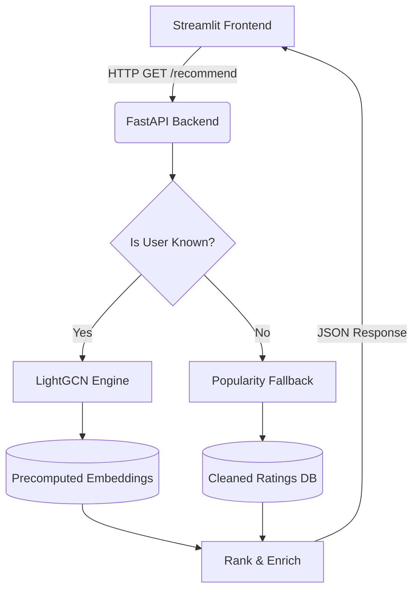
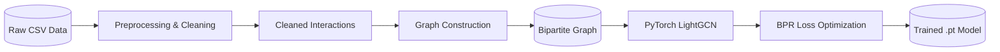
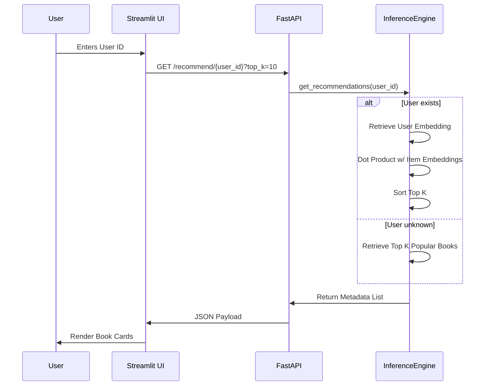

# System Diagrams

## 1. High-Level Architecture

```mermaid
graph TD
    A[Streamlit Frontend] -->|HTTP GET /recommend| B(FastAPI Backend)
    B --> C{Is User Known?}
    C -->|Yes| D[LightGCN Engine]
    C -->|No| E[Popularity Fallback]
    
    D --> F[(Precomputed Embeddings)]
    E --> G[(Cleaned Ratings DB)]
    
    F --> H[Rank & Enrich]
    G --> H
    
    H -->|JSON Response| A
```

## 2. Model Training Pipeline

```mermaid
flowchart LR
    A[(Raw CSV Data)] --> B[Preprocessing & Cleaning]
    B --> C[Cleaned Interactions]
    C --> D[Graph Construction]
    D --> E[(Bipartite Graph)]
    E --> F[PyTorch LightGCN]
    F --> G[BPR Loss Optimization]
    G --> H[(Trained .pt Model)]
```

## 3. Serving Sequence Diagram

```mermaid
sequenceDiagram
    participant User
    participant Streamlit UI
    participant FastAPI
    participant InferenceEngine
    
    User->>Streamlit UI: Enters User ID
    Streamlit UI->>FastAPI: GET /recommend/{user_id}?top_k=10
    FastAPI->>InferenceEngine: get_recommendations(user_id)
    
    alt User exists
        InferenceEngine->>InferenceEngine: Retrieve User Embedding
        InferenceEngine->>InferenceEngine: Dot Product w/ Item Embeddings
        InferenceEngine->>InferenceEngine: Sort Top K
    else User unknown
        InferenceEngine->>InferenceEngine: Retrieve Top K Popular Books
    end
    
    InferenceEngine->>FastAPI: Return Metadata List
    FastAPI->>Streamlit UI: JSON Payload
    Streamlit UI->>User: Render Book Cards
```
